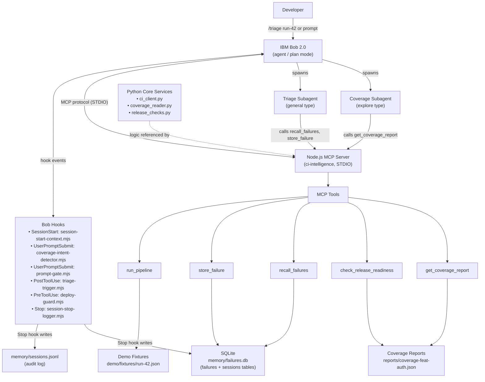

# IBM Bob CI Intelligence Agent

> **Team 4Play — IBM Bob 2.0 Hackathon**

An AI-assisted CI/CD intelligence system built around IBM Bob 2.0 that connects pipeline failures, historical failure memory, coverage analysis, and deployment safety into a single conversational workflow — without requiring developers to leave their editor.

The system uses IBM Bob as the central reasoning layer. When a CI pipeline fails, Bob automatically triggers a triage subagent that queries a SQLite-backed failure memory store, matches the failure against historical patterns, and returns a structured recommendation (rerun / fix / revert / escalate). Bob hooks enforce deployment safety by blocking dangerous commands unless a structured release-readiness gate passes first. Human approval is required before any mutating action (revert, deploy, push) is executed.

The project is implemented as a Node.js MCP server exposing five tools to Bob, a Python core services layer handling CI data validation and release-readiness logic, a SQLite failure memory store, and a set of Bob lifecycle hooks that drive the automated triage and safety workflows.

---

## Table of Contents

1. [Problem](#problem)
2. [Solution Overview](#solution-overview)
3. [System Architecture](#system-architecture)
4. [Features](#features)
   - [IBM Bob Integration](#ibm-bob-integration)
   - [MCP Tools](#mcp-tools)
   - [Failure Intelligence](#failure-intelligence)
   - [Triage Subagent](#triage-subagent)
   - [Coverage Intelligence](#coverage-intelligence)
   - [Release Readiness](#release-readiness)
   - [Deployment Safety](#deployment-safety)
   - [Notifications — watsonx Orchestrate](#notifications--watsonx-orchestrate-optional)
5. [Example Workflow](#example-workflow)
6. [Tech Stack](#tech-stack)
7. [Repository Structure](#repository-structure)
8. [Getting Started](#getting-started)
9. [Usage](#usage)
10. [MCP Tool Contracts](#mcp-tool-contracts)
11. [Security](#security)
12. [Failure Modes and Fallbacks](#failure-modes-and-fallbacks)
13. [Demo](#demo)
14. [Using This in Your Own Project](#using-this-in-your-own-project)
15. [Project Status](#project-status)
16. [Limitations](#limitations)

---

## Problem

Traditional CI/CD workflows force developers to context-switch constantly: CI dashboards, test output, Slack threads, Confluence wikis, and deployment terminals are all separate surfaces. When the same five failure signatures recur every sprint, engineers hand-diagnose them every time because there is no structured memory of past failures. Deployment gates are informal ("looks green enough"), and rollbacks happen reactively after incidents.

This project addresses three specific gaps:

1. **No institutional memory of failures.** The same `AssertionError` from a JWT middleware change gets diagnosed from scratch on every occurrence.
2. **No automated triage path.** Developers manually correlate CI logs with past Slack discussions to decide whether to rerun, fix, or revert.
3. **No structured deployment gate.** Coverage thresholds and blocker failures are checked manually, not enforced programmatically.

IBM Bob's hook system, MCP tool interface, and subagent capability make it possible to address all three gaps from within the developer's existing conversational workflow.

---

## Solution Overview

The end-to-end workflow connects Bob, the MCP server, Python services, and the failure memory store:

1. Developer runs `/triage <run-id>` in Bob, or a `PostToolUse` hook fires automatically after `run_pipeline` returns a failure.
2. Bob calls `run_pipeline({ ref })` — the MCP tool reads the failure payload from a fixture (or optionally from the GitHub Actions API if `CI_API_TOKEN` is set).
3. The `PostToolUse` hook (`triage-trigger.mjs`) fires and injects a context message instructing Bob to spawn the triage subagent.
4. The triage subagent (general type) computes `SHA-256(test_name + ":" + error_type + ":" + failing_file)` and calls `recall_failures({ signature })` to query historical matches from the SQLite failure memory store.
5. Based on the number of matches and their confidence scores, the subagent determines an action (`revert` / `rerun` / `fix` / `escalate`) and confidence level (`high` / `medium` / `low`).
6. The subagent calls `store_failure(...)` to persist the new triage result to memory.
7. The `Stop` hook (`session-stop-logger.mjs`) writes the session outcome to `memory/sessions.jsonl` and to the SQLite `sessions` table.
8. For coverage analysis, the `UserPromptSubmit` hook (`coverage-intent-detector.mjs`) detects coverage-related prompts and routes them to the coverage subagent (explore type) via `get_coverage_report`.
9. Before any deployment, `check_release_readiness` evaluates coverage threshold, open escalations, and target environment validity.
10. The `PreToolUse` hook (`deploy-guard.mjs`) intercepts `execute_command` calls and blocks patterns like `kubectl apply`, `helm upgrade`, or force-pushes to `main`/`staging` — **human approval is required before any deployment proceeds**.

---

## System Architecture



### Architectural layers

| Layer | Files | Responsibility |
|-------|-------|----------------|
| **IBM Bob config** | `.bob/settings.json`, `.bob/mcp.json`, `.bob/rules/`, `.bob/commands/` | Hooks, MCP registration, agent rules, slash commands |
| **Bob hooks** | `.bob/hooks/*.mjs` | Lifecycle event handlers: context injection, triage trigger, deploy guard, session logging |
| **Bob subagents** | `.bob/subagents/triage.md`, `.bob/subagents/coverage.md` | Triage and coverage subagent rule files |
| **MCP server** | `mcp/server.js`, `mcp/tools/*.js`, `mcp/db.js` | Node.js tool interface over STDIO; SQLite access via `sql.js` |
| **Python services** | `python/ci_client.py`, `python/coverage_reader.py`, `python/release_checks.py` | Business logic for CI data, coverage, and release readiness |
| **Failure memory** | `memory/schema.sql`, `memory/seed.sql`, `memory/failures.db` | SQLite store for failures and sessions |
| **Demo fixtures** | `demo/fixtures/run-42.json`, `reports/coverage-feat-auth.json` | Reproducible demo data; used when CI API is unavailable |
| **Evaluation** | `evaluation/benchmark.py`, `evaluation/fixtures/` | Offline benchmark measuring recall accuracy and recommendation quality |

---

## Features

### IBM Bob Integration

**Agent and plan modes** — Bob operates across both modes. Triage, coverage analysis, and release readiness are all Bob-initiated workflows accessible through the same conversational interface.

**Bob rules** — `.bob/rules/01-project.md` loads project context into every session, including the architecture overview, tool table, signature formula, and team-ownership boundaries. `.bob/rules-agent/01-triage.md` gives the triage subagent its mandatory step sequence and hard constraints.

**Slash command `/triage <run-id>`** — Defined in `.bob/commands/triage.md`. Instructs Bob to call `run_pipeline`, run the full triage flow for each failure (signature → recall → decide → store), and display a structured summary table. Supports all four outcome types: revert, rerun, fix, and escalate.

**SessionStart hook** — `session-start-context.mjs` reads the five most recent failures from `memory/failures.db` at session startup and injects them as context, so Bob is aware of recent CI history from the first message.

**UserPromptSubmit hooks** — Two hooks fire on every prompt:
- `coverage-intent-detector.mjs` detects coverage-related keywords and injects a reminder to use `get_coverage_report` and the coverage subagent.
- `prompt-gate.mjs` blocks prompts matching dangerous patterns (e.g., "deploy to production", "skip the guard", "ignore coverage") with exit code 2.

**PostToolUse hook** — `triage-trigger.mjs` fires after `mcp__ci-intelligence__run_pipeline` completes. If the pipeline result contains failures, it injects a structured context message with the failure list and instructions for the triage subagent.

**PreToolUse hook** — `deploy-guard.mjs` fires before every `execute_command` call. Commands matching blocked patterns (see [Deployment Safety](#deployment-safety)) are rejected with exit code 2, surfacing the block reason to the developer.

**Stop hook** — `session-stop-logger.mjs` runs after every session ends and appends one JSON line to `memory/sessions.jsonl`. It also writes the session record to the SQLite `sessions` table.

---

### MCP Tools

The MCP server (`mcp/server.js`) is named `ci-intelligence`, uses STDIO transport, and registers five tools. `recall_failures`, `get_coverage_report`, `run_pipeline`, and `check_release_readiness` are in `alwaysAllow` (read-only or safe); `store_failure` requires approval.

#### `run_pipeline`

| Field | Value |
|-------|-------|
| **Purpose** | Fetch or trigger a CI pipeline run; return failure payload |
| **Input** | `{ ref: string }` — git ref or run ID, e.g. `"run-42"` |
| **Output** | `{ run_id, ref, status, failures[], triggered_at, source }` |
| **Data source** | Reads `demo/fixtures/<ref>.json` first; falls back to GitHub Actions API if `CI_API_TOKEN` + `GITHUB_REPO` env vars are set |
| **Nature** | Read-only (fixture); read-only (API) |
| **Fallback** | Returns `{ status: "unknown" }` with a hint if no fixture and no API token |

#### `store_failure`

| Field | Value |
|-------|-------|
| **Purpose** | Persist a triage result to the failure memory store |
| **Input** | `{ signature, test_name, error_type, failing_file, action, confidence, confidence_score?, run_id?, session_id?, failure_message?, recommendation?, resolution?, resolved? }` |
| **Output** | `{ stored: true, failure_id: "f-<uuid>", stored_at }` or `{ stored: false, error }` |
| **Data source** | Writes to `memory/failures.db` (SQLite via `sql.js`) |
| **Nature** | Mutating — inserts one row per call |
| **Note** | Signature must be pre-computed by the caller (triage subagent) |

#### `recall_failures`

| Field | Value |
|-------|-------|
| **Purpose** | Retrieve historical CI failures matching a SHA-256 signature |
| **Input** | `{ signature: string, limit?: number }` (default limit: 5) |
| **Output** | `{ matches: [...], total_found: number }` |
| **Data source** | Reads from `memory/failures.db` using `idx_signature` index |
| **Nature** | Read-only |
| **Fallback** | Returns `{ matches: [], total_found: 0 }` if DB is empty or signature has no matches |

#### `check_release_readiness`

| Field | Value |
|-------|-------|
| **Purpose** | Run release gates and return PASS / WARNING / BLOCKER |
| **Input** | `{ ref: string, target_env?: "staging" \| "dev" }` |
| **Output** | `{ overall, checks: [{ name, status, detail }], ref, target_env }` |
| **Data source** | Reads `reports/coverage-<ref>.json` and queries `memory/failures.db` for open escalations |
| **Nature** | Read-only |
| **Gates** | Coverage threshold (80%), open unresolved escalations, valid target environment |

#### `get_coverage_report`

| Field | Value |
|-------|-------|
| **Purpose** | Fetch the latest coverage report for a git ref |
| **Input** | `{ ref: string }` |
| **Output** | `{ ref, total_coverage_pct, files: [{ path, coverage_pct, uncovered_lines[] }], source }` |
| **Data source** | Reads `reports/coverage-<ref>.json` (file-based for demo) |
| **Nature** | Read-only |
| **Fallback** | Returns `{ total_coverage_pct: null, error: "..." }` if report file not found |

---

### Failure Intelligence

**Failure signature** — Each CI failure is identified by a stable SHA-256 hash:

```
signature = SHA-256(test_name + ":" + error_type + ":" + failing_file)
```

The signature is computed by the triage subagent before every `recall_failures` call. It is stable across runs (does not depend on line numbers, timestamps, or run IDs), making it reliable for cross-run pattern matching.

**SQLite failure memory store** — `memory/failures.db` stores one row per triage event in the `failures` table. The schema defines `idx_signature` (primary recall index) and `idx_stored_at` (chronological scan for session-start injection). The database is managed by `sql.js` (pure WASM — no native compile required), making it portable across platforms.

**Seed data** — `memory/seed.sql` contains 10 pre-seeded historical failures covering: auth token expiry (2× revert, high), Redis timeout flakes (2× rerun, high), import error after dependency removal (1× fix, medium), type error from refactor (1× fix, medium), DNS flake (1× rerun, high), coverage gate failure (1× fix, high), model migration mismatch (1× fix, medium), and an unseen failure (1× escalate, low). The seed is applied by `npm run seed-db`.

**Recall behavior** — `recall_failures` queries `WHERE signature = ? ORDER BY stored_at DESC LIMIT ?`. It returns the most recent matching rows, including action, confidence score, recommendation, and resolution text.

**Confidence decision rules** (triage subagent):

| Condition | Action | Confidence |
|-----------|--------|------------|
| `total_found >= 2` AND all matches share same action AND avg `confidence_score >= 0.80` | Action from history | `high` |
| `total_found >= 1` AND avg `confidence_score >= 0.50` | Action from history | `medium` |
| `total_found == 0` OR avg `confidence_score < 0.50` | `escalate` | `low` |

Historical failure outcomes drive recommendations: when two prior failures with the same signature both resulted in a revert at high confidence, the triage subagent recommends a revert with high confidence for the new occurrence.

---

### Triage Subagent

Defined in `.bob/subagents/triage.md` and constrained by `.bob/rules-agent/01-triage.md`.

**Type:** general (has access to MCP tools)

**Mandatory workflow:**
1. Compute failure signature for each failure in the payload.
2. Call `recall_failures({ signature, limit: 5 })` — mandatory, never skipped.
3. Decide action and confidence using the three-tier rule above.
4. Return structured JSON recommendation (action, confidence, confidence_score, recommendation text, historical_matches, signature).
5. Call `store_failure(...)` with the full payload and recommendation.

**Hard constraints (enforced by rules):**
- Never call `execute_command`, `kubectl`, `git revert`, `git push`, `helm upgrade`, or any mutating OS command.
- Never recommend a deploy without a PASS from `check_release_readiness`.
- Never compute confidence without checking historical matches first.
- Always return structured JSON, never prose.

**Human approval boundary** — The subagent produces a recommendation only. Any actual revert, deploy, or push requires explicit developer approval in Bob's main conversation.

---

### Coverage Intelligence

**Coverage subagent** — Defined in `.bob/subagents/coverage.md`.

**Type:** explore (read-only — never calls mutating tools)

The subagent is spawned when:
- A coverage-related keyword is detected in a prompt (via `coverage-intent-detector.mjs`).
- `get_coverage_report` has been called and returned data.
- `check_release_readiness` returned a `BLOCKER` on `coverage_threshold`.

**Workflow:**
1. Call `get_coverage_report({ ref })` to fetch the coverage report.
2. Identify files with `coverage_pct < 80`, sorted ascending.
3. Return a structured output with total coverage, gate status, uncovered files with line numbers, and suggested test targets (descriptions only — no generated test code).

**Coverage thresholds:**

| Coverage | Status | Meaning |
|----------|--------|---------|
| ≥ 80% | PASS | Deploy is unblocked |
| 70–79% | WARNING | Deploy is allowed but flagged |
| < 70% | BLOCKER | Deploy is blocked |

**Report format** — JSON files at `reports/coverage-<ref>.json` with the schema:
```json
{
  "ref": "feat-auth",
  "total_coverage_pct": 68.0,
  "files": [
    { "path": "src/auth/middleware.py", "coverage_pct": 55.0, "uncovered_lines": [12, 13, 28] }
  ]
}
```

The seeded report for `feat/auth` (`reports/coverage-feat-auth.json`) has total coverage of 68%, falling below the 80% threshold and triggering a BLOCKER. The lowest-coverage files are `src/utils/crypto.py` (50%), `src/auth/middleware.py` (55%), and `src/auth/session.py` (60%).

**Python coverage reader** — `python/coverage_reader.py` provides `get_coverage_report(ref)` with full schema validation and structured error handling.

---

### Release Readiness

Implemented in two layers: the Node.js MCP tool (`mcp/tools/check_release_readiness.js`) and the Python business logic module (`python/release_checks.py`).

#### Gate rules (verified from `python/release_checks.py`)

| Check | PASS | WARNING | BLOCKER |
|-------|------|---------|---------|
| **Test pass rate** | 100% pass | 90–99% pass | < 90% pass, or zero tests |
| **Coverage** | ≥ 80% | 70–79% | < 70% |
| **Unresolved blockers** | 0 unresolved escalations | — | ≥ 1 unresolved escalation |
| **Branch behind main** | 0 commits behind | 1–5 behind | > 5 behind |

**Aggregation rule:** Any BLOCKER → overall `BLOCKER`. No BLOCKER but any WARNING → overall `WARNING`. All PASS → `PASS`.

**Note on the MCP layer vs. Python layer:** The Node.js MCP tool (`check_release_readiness.js`) currently implements three gates directly: coverage threshold (≥ 80%), open escalations in the failure memory store, and valid target environment. The Python `release_checks.py` module implements the full four-gate suite (including test pass rate and branch staleness) and is the authoritative business logic layer. The Node.js layer does not currently call the Python module; it implements the subset of checks available without external test-count or git data. Both implementations are consistent on the coverage threshold.

---

### Deployment Safety

**Deploy guard** — `deploy-guard.mjs` (PreToolUse hook on `execute_command`). Blocks the following patterns:

| Blocked pattern | Reason |
|-----------------|--------|
| `kubectl apply`, `kubectl create`, `kubectl delete` | Mutating Kubernetes operations |
| `helm upgrade`, `helm install` | Helm chart deployments |
| `git push` to `main`, `staging`, `production`, `prod` | Direct pushes to protected branches |
| `git push --force` | Force pushes |
| `docker push` | Image registry push |
| `ibmcloud ce app update` | IBM Code Engine app update |

The following read-only commands are explicitly **allowed** through: `kubectl get`, `kubectl describe`, `kubectl logs`, `kubectl rollout status`.

**Exit code 2** — When a command is blocked, the hook exits with code 2, causing Bob to surface the block reason to the developer. The error message instructs the developer to call `check_release_readiness` and verify `overall == "PASS"` before deploying.

**Prompt gate** — `prompt-gate.mjs` (UserPromptSubmit hook) blocks prompts matching patterns such as "deploy to production", "skip the guard", "ignore coverage", or "force push to main" before they reach the model.

**Release readiness gate** — `check_release_readiness` must return `overall: "PASS"` before a deployment is attempted. The `deploy-guard.mjs` hook blocks the deploy command; the developer must call the tool explicitly to verify the gate, then approve the deployment in Bob's main conversation.

**Rollback recommendation** — The triage subagent may recommend `action: "revert"` based on historical failure patterns. Bob proposes the revert command (e.g., `git revert <commit> && git push`), but **developer approval is required** before execution.

**Health check** — A `/health` endpoint on the MCP server for Code Engine liveness probe is described in the project plan but **not yet implemented** in the current codebase. Marked as **Optional/Planned**.

---

### Notifications — watsonx Orchestrate (Optional)

A `NotifyOnCall` Orchestrate skill that formats a Slack block-kit message from the triage recommendation and delivers it to an on-call engineer is **planned but not yet implemented** in the current repository. The project plan describes a `notify_oncall` MCP tool as the trigger. A fallback screenshot (`demo/fallback-slack.png`) is planned for demo use but is **not present** in the current repository.

---

## Example Workflow

The following scenario uses the seeded demo data and is reproducible from a fresh clone.

**Scenario:** `run-42` — JWT middleware regression on `feat/auth`

```
1. Developer:   /triage run-42

2. Bob calls:   run_pipeline({ ref: "run-42" })
   Response:    {
                  "run_id": "run-42",
                  "ref": "feat/auth",
                  "status": "failed",
                  "failures": [{
                    "test_name": "test_auth_token_expiry",
                    "error_type": "AssertionError",
                    "failing_file": "tests/test_auth.py",
                    "failure_message": "AssertionError: expected 401, got 500 — JWT middleware raised unhandled exception"
                  }],
                  "source": "fixture"
                }

3. PostToolUse hook (triage-trigger.mjs) fires:
   Injects: "CI Pipeline Failure Detected — run_id: run-42. Spawn triage subagent."

4. Bob spawns triage subagent.
   Subagent computes: signature = SHA-256("test_auth_token_expiry:AssertionError:tests/test_auth.py")
                               = "e05df3df6765b575ef14be0d76c581b5d7e29f641cd5520c270680c0fb63ecde"

5. Subagent calls:  recall_failures({ signature: "e05df3...", limit: 5 })
   Response:        {
                      "matches": [
                        { "failure_id": "f-seed-01", "action": "revert", "confidence": "high", "confidence_score": 0.92 },
                        { "failure_id": "f-seed-02", "action": "revert", "confidence": "high", "confidence_score": 0.88 }
                      ],
                      "total_found": 2
                    }

6. Subagent decides: 2 matches, avg_score=0.90 >= 0.80, same action=revert → HIGH confidence
   Returns:        {
                     "action": "revert",
                     "confidence": "high",
                     "confidence_score": 0.90,
                     "recommendation": "Revert — 2 prior failures (f-seed-01, f-seed-02) confirm JWT middleware regression on feat/auth.",
                     "historical_matches": 2
                   }

7. Subagent calls: store_failure({ ... + recommendation }) → { stored: true, failure_id: "f-<uuid>" }

8. Developer:   "Deploy the fix to staging"

9. PreToolUse hook (deploy-guard.mjs) intercepts execute_command("kubectl apply staging"):
   BLOCKED — stderr: "Deploy commands require a PASS from check_release_readiness first."

10. Bob calls:   check_release_readiness({ ref: "feat/auth", target_env: "staging" })
    Response:    {
                   "overall": "BLOCKER",
                   "checks": [
                     { "name": "coverage_threshold", "status": "BLOCKER",
                       "detail": "Coverage 68.0% is below required 80%. Deploy is blocked." },
                     { "name": "open_blockers", "status": "PASS" },
                     { "name": "target_env",    "status": "PASS" }
                   ]
                 }
    Bob explains: "Coverage 68% is 12 points below the 80% threshold. Run the coverage subagent to identify gaps."

11. Stop hook fires: session-stop-logger.mjs writes one line to memory/sessions.jsonl.
```

The `feat/auth` coverage report (`reports/coverage-feat-auth.json`) contains 68% total coverage — below both the 80% PASS threshold and the 70% WARNING boundary — resulting in a `BLOCKER` gate status. Deploying this branch is blocked until coverage reaches at least 70% (WARNING) or 80% (PASS).

---

## Tech Stack

| Layer | Technology | Purpose |
|-------|------------|---------|
| AI development layer | IBM Bob 2.0 | Agent, hooks, rules, subagents, slash commands |
| MCP server | Node.js ≥ 20 + `@modelcontextprotocol/sdk ^1.30.1` | MCP tool interface over STDIO |
| Database (MCP layer) | `sql.js ^1.14.2` (SQLite WASM) | Failure memory store; no native compile required |
| UUID generation | `uuid ^10.0.0` | Failure ID generation in `store_failure` |
| Python core services | Python 3.11 | CI client, coverage reader, release readiness logic |
| Python testing | `pytest` + `pytest-cov` | Unit and integration tests for Python services |
| Demo fixtures | Static JSON | Reproducible CI failures and coverage reports |
| Evaluation framework | Python (`sqlite3` stdlib) | Offline recall accuracy and recommendation quality benchmark |
| CI provider | GitHub Actions (optional) / fixture fallback | Pipeline execution; fixture used when API unavailable |
| Containerization / deployment | Docker + IBM Code Engine | **Optional/Planned** — remote MCP server deployment |
| Notifications | watsonx Orchestrate + Slack API | **Optional/Planned** — on-call notification skill |

---

## Repository Structure

```
IBM_Hackathon_4play/
├── bob_ci_cd_agent_plan.md         # Full project plan and architecture design
├── bob-ci-agent/                   # All project implementation lives here
│   ├── .bob/
│   │   ├── settings.json           # All five Bob hooks (SessionStart, UserPromptSubmit×2,
│   │   │                           #   PostToolUse, PreToolUse, Stop)
│   │   ├── mcp.json                # MCP server registration for ci-intelligence
│   │   ├── rules/
│   │   │   └── 01-project.md       # Project context injected into every Bob session
│   │   ├── rules-agent/
│   │   │   └── 01-triage.md        # Triage subagent mandatory workflow + constraints
│   │   ├── hooks/
│   │   │   ├── session-start-context.mjs   # SessionStart: inject last 5 failures
│   │   │   ├── coverage-intent-detector.mjs # UserPromptSubmit: detect coverage prompts
│   │   │   ├── prompt-gate.mjs              # UserPromptSubmit: block dangerous prompts
│   │   │   ├── triage-trigger.mjs           # PostToolUse: trigger triage after run_pipeline
│   │   │   ├── deploy-guard.mjs             # PreToolUse: block unsafe deploy commands
│   │   │   └── session-stop-logger.mjs      # Stop: write session log
│   │   ├── subagents/
│   │   │   ├── triage.md           # Triage subagent rules (general type)
│   │   │   └── coverage.md         # Coverage subagent rules (explore type)
│   │   └── commands/
│   │       └── triage.md           # /triage <run-id> slash command definition
│   ├── mcp/
│   │   ├── server.js               # MCP server entry point (STDIO, Node.js)
│   │   ├── db.js                   # sql.js SQLite wrapper (getDb, queryAll, run, flushDb)
│   │   └── tools/
│   │       ├── run_pipeline.js     # Fixture or GitHub API mode
│   │       ├── recall_failures.js  # Read-only signature lookup
│   │       ├── store_failure.js    # Write triage result to SQLite
│   │       ├── check_release_readiness.js  # Coverage + escalation + env gates
│   │       └── get_coverage_report.js      # Read coverage-<ref>.json
│   ├── python/
│   │   ├── __init__.py
│   │   ├── ci_client.py            # run_pipeline() with validation + fixture loading
│   │   ├── coverage_reader.py      # get_coverage_report() with schema validation
│   │   ├── release_checks.py       # Four-gate release readiness logic (pure Python)
│   │   ├── bridge.py               # CLI entry point: python -m python.bridge <ref>
│   │   └── models.py               # (empty stub)
│   ├── tests/
│   │   ├── test_ci_client.py       # 18 pytest tests for run_pipeline
│   │   ├── test_coverage_reader.py # pytest tests for coverage_reader
│   │   ├── test_release_checks.py  # pytest tests for release_checks (all four gates)
│   │   ├── test_failure_memory.py  # pytest tests for failure memory
│   │   └── test_bridge.py          # pytest tests for bridge CLI
│   ├── memory/
│   │   ├── schema.sql              # SQLite schema (failures + sessions + migrations)
│   │   ├── seed.sql                # 10 seeded historical failures
│   │   ├── failures.db             # SQLite runtime database (generated by seed-db)
│   │   └── README.md               # Memory layer interface documentation
│   ├── reports/
│   │   └── coverage-feat-auth.json # Seeded coverage report: 68% total (BLOCKER)
│   ├── demo/
│   │   └── fixtures/
│   │       └── run-42.json         # Seeded pipeline failure: auth token expiry
│   ├── evaluation/
│   │   ├── benchmark.py            # Recall accuracy + recommendation quality benchmark
│   │   ├── fixtures/
│   │   │   └── ci_failure_cases.json  # 10 benchmark test cases
│   │   └── results/                # Benchmark outputs (JSON + Markdown)
│   ├── scripts/
│   │   ├── seed-db.js              # Applies schema.sql + seed.sql to failures.db
│   │   └── integration-test.js     # Integration test script
│   ├── AGENTS.md                   # Root project context for Bob (currently empty)
│   ├── conftest.py                 # pytest sys.path configuration
│   ├── requirements-dev.txt        # pytest, pytest-cov
│   └── package.json                # Node.js dependencies and npm scripts
└── README.md                       # This file
```

---

## Getting Started

### Prerequisites

- **IBM Bob 2.0** — with a workspace opened at the repository root (`d:/IBM_Hackathon_4play` or the equivalent)
- **Node.js ≥ 20** — required by the MCP server and hook scripts
- **Python 3.11** — required by the Python core services and tests

### Installation

**1. Clone the repository**

```bash
git clone <repo-url>
cd IBM_Hackathon_4play
```

**2. Install Node.js dependencies**

```bash
cd bob-ci-agent
npm install
```

This installs `@modelcontextprotocol/sdk`, `sql.js`, and `uuid`.

**3. Set up the Python environment**

```bash
# From bob-ci-agent/
python -m venv .venv

# Windows
.venv\Scripts\activate

# macOS / Linux
source .venv/bin/activate
```

**4. Install Python dev dependencies**

```bash
pip install -r requirements-dev.txt
```

**5. Seed the failure memory database**

```bash
npm run seed-db
```

This applies `memory/schema.sql` (creates tables and indexes) and `memory/seed.sql` (inserts 10 historical failures) to `memory/failures.db`. The script also runs three integration checks and exits non-zero on failure.

Expected output:
```
[seed-db] Total failure rows in DB: 10
[seed-db] Integration check — auth token expiry (eval-01 / run-42):
  Signature : e05df3df...
  Matches   : 2 (expected 2)
  ✓ PASS — f-seed-01 and f-seed-02 found: action=revert, confidence=high
[seed-db] Negative test A — unseen billing failure:
  ✓ PASS — 0 matches, correctly routes to escalate
[seed-db] Negative test B — auth test with test_oauth.py (different file):
  ✓ PASS — 0 matches, signature isolation confirmed
```

**6. Run Python tests**

```bash
# From bob-ci-agent/
pytest tests/ -v
```

**7. Open the project in IBM Bob**

Open Bob in the `d:/IBM_Hackathon_4play` directory. Bob automatically reads `.bob/mcp.json` and starts the MCP server (`node bob-ci-agent/mcp/server.js`) via STDIO. The `ci-intelligence` server and all five tools appear in Bob's tool list.

**8. Optional — set environment variables for live CI access**

```bash
# Not required for demo — fixture fallback is used when these are absent
export CI_API_TOKEN="ghp_..."          # GitHub personal access token
export GITHUB_REPO="owner/repo-name"  # e.g. "SiddharthAgr/ibm_hackethon_4play"
```

Do **not** commit these values. The `.bob/mcp.json` passes them as environment variable references (`${CI_API_TOKEN}`).

---

## Usage

### A. Normal developer workflow

Open the repository in IBM Bob. The `SessionStart` hook fires automatically and injects the five most recent failures into context. The developer can immediately ask about recent CI history, request triage, or check coverage — all within the Bob chat interface.

### B. Trigger triage with the slash command

```
/triage run-42
```

Bob calls `run_pipeline({ ref: "run-42" })`, reads the failure from `demo/fixtures/run-42.json`, and the `PostToolUse` hook triggers the triage subagent automatically. The result is a structured recommendation table showing test, error, action, confidence, and matched history count.

### C. Trigger triage via natural language

```
Triage the failed pipeline on feat/auth
```

Bob calls `run_pipeline({ ref: "feat/auth" })`. If no matching fixture exists and no API token is set, the tool returns `status: "unknown"` with a hint to add a fixture.

### D. Inspect a coverage report

```
What is the test coverage for feat/auth?
```

The `coverage-intent-detector.mjs` hook detects the coverage keyword and injects context. Bob calls `get_coverage_report({ ref: "feat/auth" })`, which reads `reports/coverage-feat-auth.json`. Bob spawns the coverage subagent, which returns a structured gap summary with per-file coverage, uncovered line numbers, and suggested test targets.

### E. Check release readiness

```
Is feat/auth ready to deploy to staging?
```

Bob calls `check_release_readiness({ ref: "feat/auth", target_env: "staging" })`. For the seeded report, coverage is 68% and the result is `overall: "BLOCKER"`.

### F. Observe the deployment gate

```
Deploy feat/auth to staging
```

The `PreToolUse` hook (`deploy-guard.mjs`) fires before any matching `execute_command`. If the command matches a blocked pattern, Bob surfaces the block message:

```
[deploy-guard] BLOCKED: "kubectl apply staging"
Reason: Deploy commands require a PASS from check_release_readiness first.
```

### G. Run the evaluation benchmark

```bash
# From bob-ci-agent/
python evaluation/benchmark.py
```

This runs the 10 recall/recommendation test cases against `memory/failures.db` and writes results to `evaluation/results/`. The most recent benchmark result (`benchmark_20260926T094322Z.md`) shows 100% retrieval accuracy, 100% recommendation match rate, and 100% escalation accuracy across all 10 cases, with p50 latency of 0.024 ms.

---

## MCP Tool Contracts

| Tool | Purpose | Input | Output | Source | Nature |
|------|---------|-------|--------|--------|--------|
| `run_pipeline` | Fetch CI pipeline run result | `{ ref }` | `{ run_id, ref, status, failures[], triggered_at, source }` | `demo/fixtures/<ref>.json` or GitHub API | Read-only |
| `recall_failures` | Retrieve failures by signature | `{ signature, limit? }` | `{ matches[], total_found }` | `memory/failures.db` | Read-only |
| `store_failure` | Persist triage result | `{ signature, test_name, error_type, failing_file, action, confidence, ... }` | `{ stored, failure_id, stored_at }` | `memory/failures.db` | Mutating |
| `check_release_readiness` | Run release gates | `{ ref, target_env? }` | `{ overall, checks[], ref, target_env }` | `reports/coverage-<ref>.json` + `memory/failures.db` | Read-only |
| `get_coverage_report` | Fetch coverage breakdown | `{ ref }` | `{ ref, total_coverage_pct, files[], source }` | `reports/coverage-<ref>.json` | Read-only |

---

## Security

### Implemented controls

| Control | Implementation | Level |
|---------|----------------|-------|
| Blocked deploy patterns | `deploy-guard.mjs` PreToolUse hook; regexp match on `kubectl apply`, `helm upgrade`, `git push --force`, etc. | Blocking (exit 2) |
| Prompt-level safety | `prompt-gate.mjs` UserPromptSubmit hook; blocks "deploy to production", "skip the guard", "ignore coverage" | Blocking (exit 2) |
| Secrets via environment variables | `CI_API_TOKEN` passed via `.bob/mcp.json` env section; never committed | Enforced by convention |
| Session audit log | `Stop` hook writes `memory/sessions.jsonl` and SQLite `sessions` table | Audit trail |
| Read-only subagents | Triage and coverage subagents are constrained by rules from calling mutating commands | Convention (rules-enforced, not sandboxed) |
| `alwaysAllow` for read-only tools | `recall_failures`, `get_coverage_report`, `run_pipeline`, `check_release_readiness` in `alwaysAllow` | Reduces friction for safe operations |
| Human approval before deployment | Deploy guard blocks the command; developer must approve in conversation | Procedural |

### Simulated / non-enforced controls

| Control | Reason simulated | Production equivalent |
|---------|------------------|-----------------------|
| Secret scanning | No scanner in current scope | `gitleaks` PostToolUse hook |
| RBAC on memory store | Single-user demo; SQLite has no auth layer | Db2 or PostgreSQL with role-based access |
| TLS for MCP server | Local STDIO transport used; no network exposure | Code Engine deployment uses HTTPS + IBM Cloud cert |
| Subagent sandboxing | Rules-based only; no OS-level sandbox | Dedicated container or restricted execution environment |

---

## Failure Modes and Fallbacks

| Failure | Detection | Fallback |
|---------|-----------|---------|
| CI API unavailable / no `CI_API_TOKEN` | `run_pipeline` checks fixture first; API is only attempted when env vars are set | Returns fixture from `demo/fixtures/<ref>.json`; returns `{ status: "unknown" }` with hint if no fixture |
| Failure memory DB missing | `db.js` checks `fs.existsSync(DB_PATH)` on init | Creates a new database; `recall_failures` returns `{ matches: [], total_found: 0 }`; triage proceeds as new failure |
| Coverage report not found | `get_coverage_report` checks file existence | Returns `{ total_coverage_pct: null, error: "..." }`; `check_release_readiness` returns `WARNING` for that gate |
| `session-start-context.mjs` DB missing | Hook checks `existsSync(DB_PATH)` | Exits 0 silently; session starts without failure context injection |
| Hook script missing or fails | Bob fails open — a hook error does not block the session | Session continues; the specific hook event is not processed |
| `session-stop-logger.mjs` write failure | Try/catch around both JSONL and SQLite writes | Logs warning to stderr; exits 0 so session end is not blocked |
| Triage subagent timeout | Bob shows timeout in transcript | Pre-recorded demo fallback (`demo/fallback-triage.mp4`) — **file not present in current repository** |
| watsonx Orchestrate unavailable | `notify_oncall` tool not yet implemented | Not applicable in current implementation |

---

## Demo

### Scenario

The demo demonstrates the full failure → triage → coverage → deployment-block workflow using reproducible seeded data. No live CI infrastructure is required.

### Sequence

| Step | Action | What is shown |
|------|--------|---------------|
| 1 | Open Bob in the repository directory | `ci-intelligence` MCP server starts; `.bob/settings.json` hooks load; `SessionStart` hook injects last 5 seeded failures into context |
| 2 | `/triage run-42` | Bob calls `run_pipeline`; fixture loaded; auth token expiry failure displayed |
| 3 | PostToolUse hook fires | `triage-trigger.mjs` injects context; triage subagent spawned (visible in transcript) |
| 4 | Triage subagent runs | `recall_failures` called with signature `e05df3...`; 2 historical matches returned; `action: revert, confidence: high` recommendation produced; `store_failure` called |
| 5 | "Deploy the fix to staging" | `deploy-guard.mjs` blocks `kubectl apply staging`; block message surfaced in chat |
| 6 | `check_release_readiness` | Coverage 68% < 80%; overall `BLOCKER`; Bob explains gap and suggests coverage subagent |
| 7 | Coverage query | `get_coverage_report` returns per-file breakdown; coverage subagent identifies `src/utils/crypto.py` (50%) and `src/auth/middleware.py` (55%) as highest-priority targets |
| 8 | Session ends | `session-stop-logger.mjs` writes to `memory/sessions.jsonl` |

### Which parts are simulated / fixture-based

- `run_pipeline` reads from `demo/fixtures/run-42.json` — **fixture-based**
- Coverage reports read from `reports/coverage-feat-auth.json` — **fixture-based**
- 10 seeded historical failures in `memory/failures.db` — **seeded demo data**
- GitHub Actions integration — **optional**; requires `CI_API_TOKEN` + `GITHUB_REPO`
- watsonx Orchestrate Slack notification — **not yet implemented**

---

## Using This in Your Own Project

### Prerequisites

- IBM Bob 2.0 with MCP and hooks support
- Node.js ≥ 20
- Python 3.11

### Integration steps

1. **Copy the MCP server** — Copy `bob-ci-agent/mcp/` into your project. Run `npm install` to install `@modelcontextprotocol/sdk`, `sql.js`, and `uuid`.

2. **Register the MCP server with Bob** — Create `.bob/mcp.json` in your project's workspace root:
   ```json
   {
     "mcpServers": {
       "ci-intelligence": {
         "command": "node",
         "args": ["path/to/mcp/server.js"],
         "env": {
           "CI_API_TOKEN": "${CI_API_TOKEN}",
           "GITHUB_REPO": "${GITHUB_REPO}"
         },
         "alwaysAllow": ["recall_failures", "get_coverage_report", "run_pipeline", "check_release_readiness"]
       }
     }
   }
   ```

3. **Connect `run_pipeline` to your CI system** — Edit `mcp/tools/run_pipeline.js`. The tool currently supports fixture files and the GitHub Actions REST API. To integrate with another CI provider (Jenkins, GitLab CI, Tekton), replace the API call section. Fixture mode always takes precedence when a matching file exists in `demo/fixtures/`.

4. **Configure the Python core services** — Copy `bob-ci-agent/python/` into your project. `ci_client.py` and `coverage_reader.py` resolve paths relative to their own location. The `release_checks.py` module is a pure logic layer — wire its inputs (passed tests, total tests, coverage %, commits behind, unresolved blocker count) to your data sources.

5. **Provide coverage reports** — Generate coverage reports in the format `reports/coverage-<ref>.json` (see [Coverage Intelligence](#coverage-intelligence) for the schema). Replace `<ref>` with the branch or run identifier used in `get_coverage_report` calls. For branches with slashes (e.g., `feat/auth`), the MCP tool normalises to `coverage-feat-auth.json`.

6. **Seed the failure memory** — Copy `memory/schema.sql` and `memory/seed.sql`. Edit `seed.sql` to replace the demo failures with real historical failures from your project. Run `npm run seed-db`. Add more rows to `seed.sql` as your failure history grows.

7. **Configure Bob hooks** — Copy `.bob/settings.json` to your workspace root. Review each hook for relevance. The `deploy-guard.mjs` blocked patterns are defined as constants at the top of the file — edit them to match your deployment commands. The `prompt-gate.mjs` blocked patterns can be extended for your organization's policies.

8. **Configure release-readiness thresholds** — The 80% coverage threshold is defined as `COVERAGE_THRESHOLD = 80` in `mcp/tools/check_release_readiness.js`. The Python layer thresholds are in `python/release_checks.py` (coverage: 80/70, pass rate: 100/90, branch behind: 5). Update both files if your project uses different thresholds.

9. **Add deployment safety rules** — Edit the `BLOCKED_PATTERNS` array in `.bob/hooks/deploy-guard.mjs` to match your deployment surface (Kubernetes, Helm, IBM Code Engine, AWS, etc.).

10. **Test each MCP tool independently** — Run the seed script and verify the integration checks pass. Then call each tool from Bob directly to confirm the responses match expectations.

11. **Run an end-to-end workflow** — Use `/triage <your-run-id>` with a fixture you create in `demo/fixtures/`. Verify the full triage → recall → store → session-log chain executes correctly.

### Customization points

| Component | What to change | File |
|-----------|----------------|------|
| CI provider | Replace the API call in fixture-absent path | `mcp/tools/run_pipeline.js` |
| Coverage format | Adapt the JSON schema to match your tool output | `mcp/tools/get_coverage_report.js`, `python/coverage_reader.py` |
| Coverage report path | Change the `reports/` directory convention | `mcp/tools/check_release_readiness.js`, `mcp/tools/get_coverage_report.js` |
| Release thresholds | Update PASS/WARNING/BLOCKER boundaries | `mcp/tools/check_release_readiness.js`, `python/release_checks.py` |
| Blocked deploy patterns | Add/remove regexp patterns | `.bob/hooks/deploy-guard.mjs` |
| Failure memory seed data | Replace demo failures with real history | `memory/seed.sql` |
| Bob hooks | Add/remove hooks; adjust matchers and timeouts | `.bob/settings.json` |
| Notification integration | Implement `notify_oncall` MCP tool | New file in `mcp/tools/` |
| Coverage threshold in coverage subagent | Update gate threshold comment | `.bob/subagents/coverage.md` |

### Important warning

**This repository currently uses demo fixtures and fallbacks throughout.** `run_pipeline` reads from `demo/fixtures/`, coverage reports are static files in `reports/`, and the failure memory is pre-seeded rather than driven by real CI events.

A production deployment must:
- Replace the fixture-based `run_pipeline` path with a real CI provider client.
- Generate coverage reports from actual test runs and store them at the expected path.
- Replace the seeded failure memory with records from real pipeline history.
- Replace local STDIO MCP transport with an authenticated remote transport (HTTPS via IBM Code Engine or equivalent) if multi-user access is required.
- Replace the rules-based subagent constraints with sandboxed execution if the threat model requires it.

This README does not claim to provide a universal drop-in installation. Manual adaptation to your CI infrastructure is required.

---

## Project Status

### Implemented

- Node.js MCP server (`mcp/server.js`) with all five registered tools
- `run_pipeline` — fixture mode and optional GitHub Actions API mode
- `recall_failures` — SQLite signature lookup with `idx_signature` index
- `store_failure` — SQLite insert with UUID generation and schema validation
- `check_release_readiness` — coverage threshold, open escalation, and target environment gates
- `get_coverage_report` — file-based coverage report reader
- SQLite failure memory store (`memory/failures.db`) with `failures` and `sessions` tables
- `memory/schema.sql` with two indexes and schema migrations table
- `memory/seed.sql` with 10 seeded historical failures across 8 failure categories
- `npm run seed-db` script with integration verification checks
- All five Bob lifecycle hooks: `session-start-context.mjs`, `coverage-intent-detector.mjs`, `prompt-gate.mjs`, `triage-trigger.mjs`, `deploy-guard.mjs`, `session-stop-logger.mjs`
- Triage subagent definition (`.bob/subagents/triage.md`) with mandatory workflow and hard constraints
- Coverage subagent definition (`.bob/subagents/coverage.md`) with gap analysis workflow
- `/triage <run-id>` slash command (`.bob/commands/triage.md`)
- Bob rules files (`.bob/rules/01-project.md`, `.bob/rules-agent/01-triage.md`)
- `.bob/settings.json` (all five hooks configured) and `.bob/mcp.json` (MCP registration)
- Python `ci_client.py` (`run_pipeline`) with validation, fixture loading, and schema verification
- Python `coverage_reader.py` (`get_coverage_report`) with schema validation
- Python `release_checks.py` (`check_release_readiness`) implementing all four gates with exact thresholds
- Python `bridge.py` CLI entry point for calling `run_pipeline` from an external process
- Python test suite: `test_ci_client.py` (18 tests), `test_coverage_reader.py`, `test_release_checks.py`, `test_failure_memory.py`, `test_bridge.py`
- Demo fixtures: `demo/fixtures/run-42.json`, `reports/coverage-feat-auth.json`
- Evaluation framework: `evaluation/benchmark.py` with 10 test cases; benchmark results committed (100% accuracy on all metrics)

### Optional / Planned

- **watsonx Orchestrate `NotifyOnCall` skill** — Slack notification for on-call engineers after triage. Described in the project plan; not yet implemented.
- **`notify_oncall` MCP tool** — Trigger for Orchestrate notification. Not yet implemented.
- **IBM Code Engine deployment** — Remote Streamable HTTP transport for multi-user scenarios. Not yet implemented.
- **Live GitHub Actions webhook** — Event-driven pipeline failure intake instead of manual trigger. Not yet implemented.
- **`/health` endpoint** — MCP server health check for Code Engine liveness probe. Not yet implemented.
- **Demo fallback recordings** — `demo/fallback-triage.mp4` and `demo/fallback-slack.png` are described in the plan but are not present in the current repository.

### Out of Scope

- Web UI dashboard
- Multi-workspace support
- User authentication on the MCP server
- Fine-tuned model (watsonx foundation models used as-is via Bob)

---

## Limitations

- **Demo fixtures** — `run_pipeline` and `get_coverage_report` use static JSON files. Real CI results and coverage data require connecting to a live provider.
- **Local STDIO transport** — The MCP server runs over STDIO, which means it is local to the developer's machine. There is no authentication layer on the MCP interface in the current implementation.
- **Single-repository scope** — The system is designed and tested for a single repository. Multi-repo support would require extending the fixture and coverage report conventions.
- **Subagent constraints are convention-based** — The triage and coverage subagents are constrained by rules files (`rules-agent/`, `subagents/`), not by OS-level sandboxing. A subagent that violates the rules could in principle call mutating commands.
- **Optional live integrations** — GitHub Actions API, watsonx Orchestrate, and IBM Code Engine deployment are all optional and require additional configuration not present in the default repository.
- **`memory/failures.db` committed** — The seeded SQLite database is committed to the repository for demo convenience. In a team environment it should be excluded from version control and generated at setup time.
- **Python layer not called by MCP layer at runtime** — The Python `release_checks.py` module implements the full four-gate suite, but the Node.js MCP tool (`check_release_readiness.js`) implements its own three-gate subset independently. The Python module is exercised by the pytest test suite, not by the runtime MCP call path.
